# Machine Learning with Python
Machine Learning Notes

_What we'll cover in this repository?_

Machine Learning  
✅Linear Regression  
✅Logistic Regression  
✅KNN (K-Nearest Neighbors)  
✅CART (Classification and Regression Tree)  
✅Advanced Tree Methods (Random Forests, Gradient Boosting Machines, XGBoost, LightGBM, CatBoost)  
✅Unsupervised Learning (K-Means, HCA, PCA)  
✅Machine Learning Pipeline  

---

**Before we begin reviewing the repository, there are some topics we need to look:**

| Variable Types (Değişken Türleri) 												 						  	 |
|----------------------------------------------------------------------------------------------------------------|
| Numeric Variables [Sayısal Değişkenler]											 						 	 |
| Categorical Variables [Kategorik Değişkenler] --> (Nominal, Ordinal) 					 						 |
| Dependent Variables [Bağımlı Değişkenler] --> (target, dependent, output, response) 	 						 |
| Independent Variables [Bağımsız Değişkenler] --> (feature, independent, input, column, predictor, explanatory) |

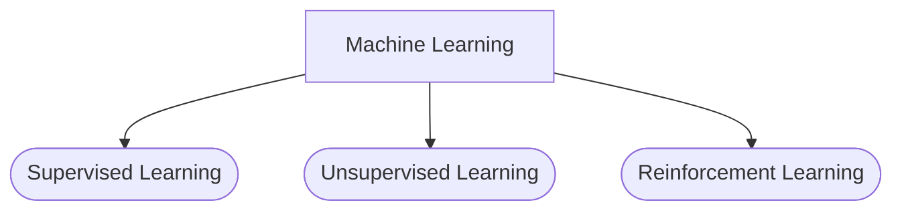

$$
Accuracy=\frac{\text{Number of Correct Classifications}}{\text{Total Number of Classified Observations}}
$$

*Holdout*  

    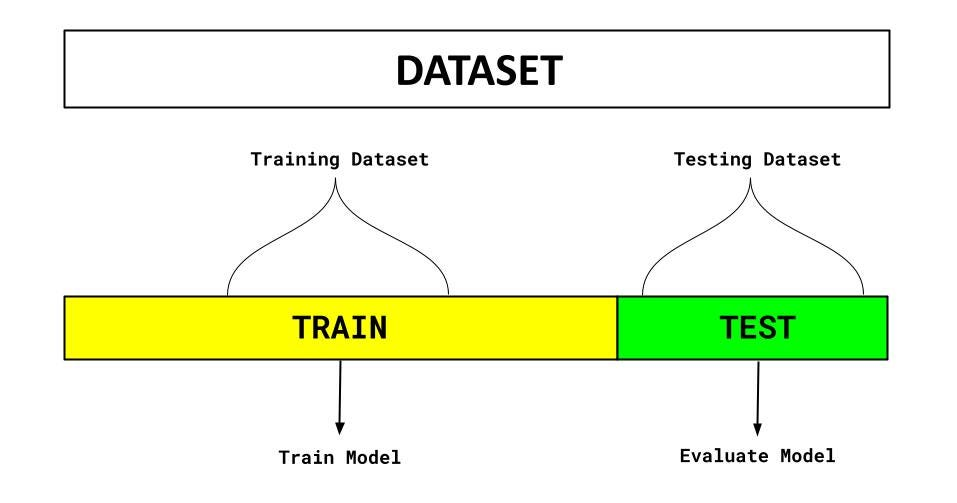

<!--  -->

*K-Fold*  

    

<!--  -->

*Bias*  

    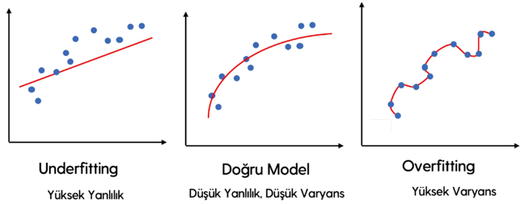

<!--  -->

*Optimum*  

    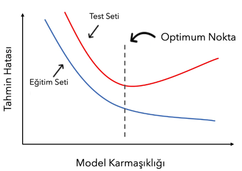

<!--  -->

### Linear Regression
> The aim is to model the relationship between dependent and independent variable(s) linearly.

$$
\widehat y_{i}=b+wx_{i}
$$

$$
\widehat y_{i} =b+ w_{1} x_ {1} + w_ {2} x_ {2} + w_ {3} x_ {3} + \cdots + w_ {p} x_ {p}
$$

> By finding the values of b and w that minimize the sum/average of the squares of the differences between actual values and predicted values

**Performance Evaluation in Regression Models**

*MSE_RMSE_MAE*  

    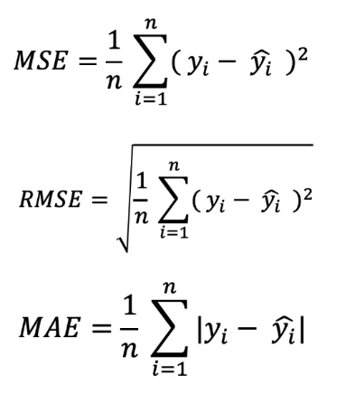

<!--  -->

**Parameter Estimation (Finding Weights)**  
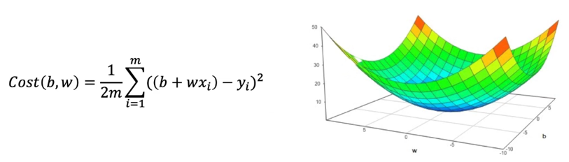

**Analytical Solution**  
The Normal Equations Method (Least Squares Method)  

    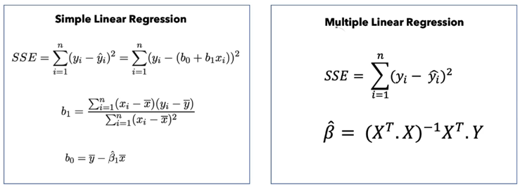

<!--  -->

**Optimization Solution: Gradient Descent**  
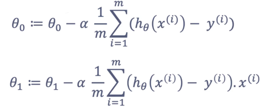

Repeat until convergence{

$$
\theta_{j} \leftarrow \theta_{j} - \alpha \frac{\partial}{\partial\theta_{j}} J(\theta)
$$

}

*How does gradient descent work?*

Gradient descent is a method used to find the parameter values that minimize a given function. It operates as follows:

1. Objective: The goal is to optimize any differentiable function to find the parameters that minimize it.
2. Derivative Calculation: The algorithm calculates the partial derivative of the relevant function with respect to the corresponding parameter.
3. Update: It updates the parameter values in the direction opposite to the gradient, which represents the maximum increase of the function. This update is performed with a certain magnitude at each iteration.
4. Error Reduction: By updating the parameter values iteratively, the algorithm aims to reduce the error in each iteration.

> In summary, gradient descent is an iterative optimization technique that adjusts parameter values based on the gradient (rate of change) of a function to minimize the function's value.

> *It iteratively updates parameter values in the direction of 'steepest descent,' defined as the negative gradient, to find the parameter values that minimize the relevant function.*

It is used to find the parameter values that can minimize the cost function.  
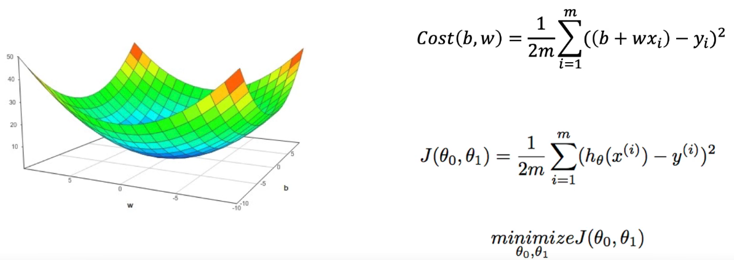

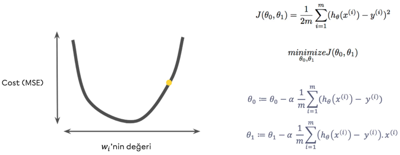

### Logistic Regression
> The aim is to model the relationship between dependent and independent variables linearly for a classification problem.

$$
\widehat y_{i} = \frac{1}{1+e^{-(z)}} 
$$

$$
z=b+ w_{1} x_{1} + w_{2} x_{2} + w_{3} x_{3} + \cdots + w_{p} x_{p} 
$$

How?
By finding the weights that minimize the log loss value, which is related to the differences between actual values and predicted values.  
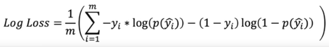

#### Confusion Matrix

|     ConfMat     | Predicted Class = 1 |  Predicted Class = 0  |
|-----------------|---------------------|-----------------------|
| Real Class = 1  | True Positive (TP)  |  False Negative (FN)  |
| Real Class = 0  | False Positive (FP) |  True Negative (TN)   |

- Accuracy: Correct classification rate -> (TP+TN) / (TP+TN+FP+FN)
- Precision: It is the success rate of positive class (1) predictions. -> TP / (TP+FP)
- Recall: It is the rate at which the positive class (1) is correctly predicted -> TP / (TP+FN)
- F1 Score: 2 * (Precision * Recall) / (Precision + Recall)

**ROC Curve (Receiver Operating Characteristic Curve)**  

    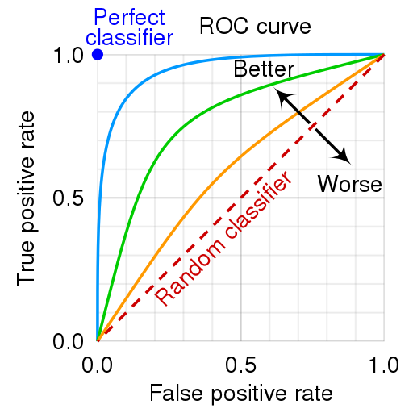

<!-- -->

_Area Under Curve_ 

- It is the expression of the ROC curve with a single numerical value
- It is the area under the ROC curve
- AUC is an aggregated performance measure for all possible classification thresholds

### CART (Classification and Regression Tree)
> The aim is to simplify complex structures within the dataset into simple decision structures.

> Heterogeneous datasets are divided into homogeneous subgroups based on a specified target variable.

Cost/Loss/Objective Function for regression problems:

    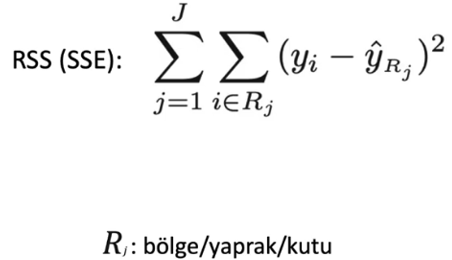

<!--  -->

Cost/Loss/Objective function for Classification Problems:

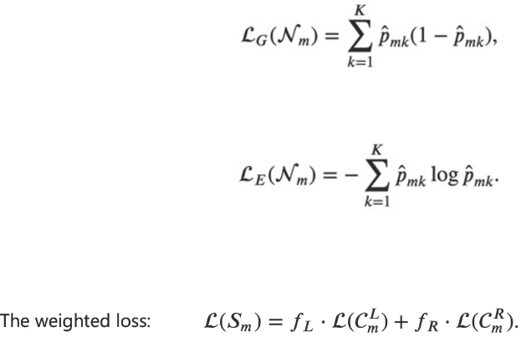

Gini Value Calculation:

    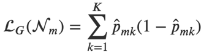

<!--  -->

### Advanced Tree Methods
#### Random Forests
> It is based on aggregating predictions generated by multiple decision trees for evaluation.

- It is formed by the combination of *Bagging* and *Random Subspace* methods.
- For trees, observations are selected using the bootstrap random sampling method, and variables are selected using **the random subspace method**.
- At each node of the decision tree, the best splitter (information gain) variable is selected from among a randomly chosen subset of variables, which is fewer in number than all variables.
- 2/3 of the data set is used to create the tree. The remaining data is used to evaluate the performance of the trees and determine the importance of the variables.
- A random variable is selected at each node point. (p divided by 3 in regression, p square root in classification)

    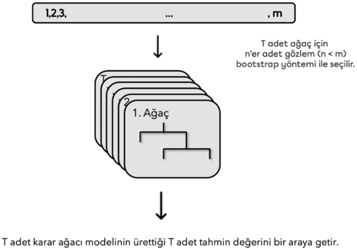

#### AdaBoost (Adaptive Boosting)
> It is based on the idea of weak classifiers coming together to create a strong classifier.

    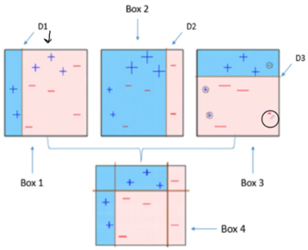

#### Gradient Boosting Machines (GBM)
> A series of models in the form of a single predictive model is built on errors/residuals.

- Boosting + Gradient Descent
- Gradient boosting creates a series of models in the form of a single predictive model.
- A model in the series is built by fitting on the prediction residuals/errors of the previous model in the series.
- GBM uses the Gradient Descent algorithm, which can optimize any differentiable loss function.
- The series of models, all in the form of a single predictive model, are built additively.

    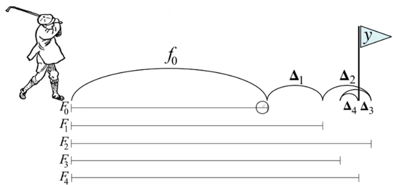

 

    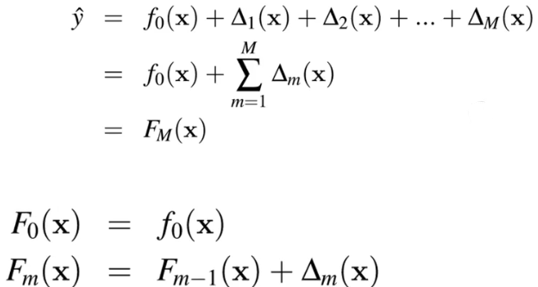

#### XGBoost (eXtreme Gradient  Boosting)
> XGBoost is an optimized version of GBM that is designed to improve speed and prediction performance. It is also scalable and can be integrated with different platforms.

- Here are some of the specific optimizations that make XGBoost faster and more accurate than GBM:

    - **Parallelism:** XGBoost uses parallelism to train models on multiple cores or machines. This can significantly reduce the training time for large datasets.
    - **Regularization:** XGBoost uses regularization to prevent overfitting. This can improve the accuracy of the model on unseen data.
    - **Tree pruning:** XGBoost uses tree pruning to remove unnecessary branches from the trees. This can further improve the speed and accuracy of the model.

#### LightGBM
> LightGBM is another type of GBM developed to improve the training time performance of XGBoost.

> It is faster with the Leaf-wise growth strategy instead of the Level-wise growth strategy.

- LightGBM uses a leaf-wise growth strategy, which is different from the level-wise growth strategy used by XGBoost. The leaf-wise growth strategy starts by growing leaves from the bottom of the tree to the top. This can lead to faster training times, as the model does not need to consider the entire tree when making decisions.
- LightGBM is also designed to be more memory efficient than XGBoost. This is because it uses a sparse representation of the trees, which can save memory when working with large datasets.
- LightGBM is a popular choice for a variety of machine learning tasks, including classification, regression, and anomaly detection. It is often used in Kaggle competitions, where it has consistently outperformed other gradient boosting models.

- Here are some of the specific optimizations that make LightGBM faster than XGBoost:

    -  **Leaf-wise growth strategy:** LightGBM uses a leaf-wise growth strategy, which is more efficient than the level-wise growth strategy used by XGBoost.
    -  **Sparse representation:** LightGBM uses a sparse representation of the trees, which can save memory when working with large datasets.
    - **Parallelism:** LightGBM uses parallelism to train models on multiple cores or machines. This can significantly reduce the training time for large datasets.
_LightGBM is a powerful tool that can be used to improve the accuracy of machine learning models. It is a good choice for a variety of tasks and is often used in competitions._

#### CatBoost
> CatBoost is another variant of GBM that can automatically handle categorical variables, it is fast and successful.

- CatBoost uses a novel algorithm that allows it to handle categorical variables more efficiently than other gradient boosting models. This can lead to significant improvements in accuracy, especially for datasets with a large number of categorical variables.

### Unsupervised Learning
#### K-Means
> The aim is to cluster observations into groups based on their similarities to each other.

- Step 1: Set the number of clusters.
- Step 2: Randomly select k centers.
- Step 3: Calculate the distances from each observation to the k centers.
- Step 4: Assign each observation to the cluster with the closest center.
- Step 5: Recalculate the centers for the formed clusters.
- Step 6: Repeat this process for a specified number of iterations and select the clustering structure of the observations where the total within-cluster variation is minimum as the final clustering.

*Explanation:*

> K-Means is a clustering algorithm that aims to partition a set of data points into a predefined number of clusters. The algorithm works by iteratively assigning each data point to the cluster with the closest center. The centers of the clusters are then updated based on the data points that have been assigned to them. This process is repeated until the centers of the clusters no longer change or until a maximum number of iterations has been reached.

*Applications:*

- K-Means is a popular clustering algorithm that can be used for a variety of applications, including:

    - **Customer segmentation:** K-Means can be used to segment customers into groups based on their shared characteristics. This information can then be used to target marketing campaigns or products more effectively.
    - **Market segmentation:** K-Means can be used to segment markets into groups based on their shared characteristics. This information can then be used to develop new products or services that meet the needs of specific market segments.
    - **Image clustering:** K-Means can be used to cluster images based on their visual features. This information can then be used to organize images or to identify similar images.

*Advantages and disadvantages:*

- K-Means is a simple and efficient clustering algorithm that can be used for a variety of applications. However, it has some limitations, including:

    - K-Means is sensitive to the initial choice of centers. If the initial centers are not well-chosen, the algorithm may converge to a suboptimal solution.
    - K-Means is not always able to find the optimal clustering structure. In some cases, the algorithm may find a clustering structure that is not optimal in terms of minimizing the within-cluster variation.

#### Hierarchical Cluster Analysis (HCA)

    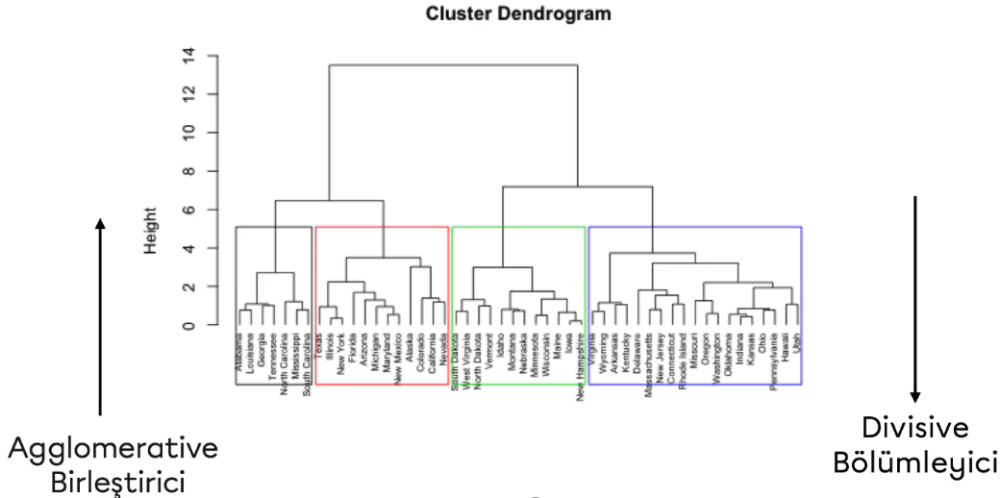

> Hierarchical clustering analysis is a statistical technique that partitions data into groups based on their similarities. In this technique, data initially starts as separate observations and are then merged based on their similarities. This process is repeated to create a hierarchical tree structure.

There are two main approaches to hierarchical clustering analysis:

- **Agglomerative** approach: In this approach, data initially starts as separate observations and are then merged by the most similar observations to form clusters. This process is repeated until the clusters become less similar to each other.
- **Divisive** approach: In this approach, data initially starts as a single cluster and is then divided into smaller clusters by separating unique observations or clusters. This process is repeated until the clusters are sufficiently different from each other.

- Some advantages of hierarchical clustering analysis include:

    - Helps visualize the similarities of data. The hierarchical tree structure is a way to visualize the similarities of data.
    - Easy to use. Hierarchical clustering analysis is easier to use than other clustering techniques.

- Some disadvantages of hierarchical clustering analysis include:

    - The number of clusters must be known beforehand. Hierarchical clustering analysis requires the number of clusters to be pre-determined.
    - The results are subjective. The results of hierarchical clustering analysis can vary depending on the similarity metric used and the characteristics of the data set.

- Some common similarity metrics for hierarchical clustering analysis include:

    - **Euclidean distance:** This metric measures the distance between two observations.
    - **Manhattan distance:** This metric measures the point-to-point distance between two observations.
    - **Pearson correlation coefficient:** This metric measures the linear relationship between two observations.

#### Principal Component Analysis (PCA)
> The basic idea is to represent the main characteristics of multivariate data with a smaller number of variables/components.

> In other words, it is about reducing the dimensionality of the variables while accepting a small amount of information loss.

    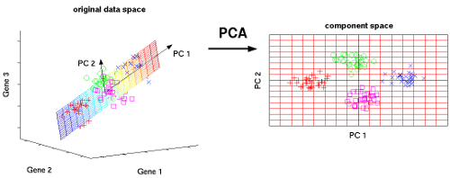

_In machine learning, PCA is often used for:_

- **Dimensionality reduction:** PCA can be used to reduce the number of features in a dataset without losing too much information. This can be useful for improving the performance of machine learning algorithms, such as classification and regression.
- **Feature extraction:** PCA can be used to extract new features from a dataset that are more informative than the original features. This can be useful for improving the performance of machine learning algorithms.
- **Data visualization:** PCA can be used to visualize high-dimensional data in a lower-dimensional space. This can make it easier to understand the relationships between the data points.

